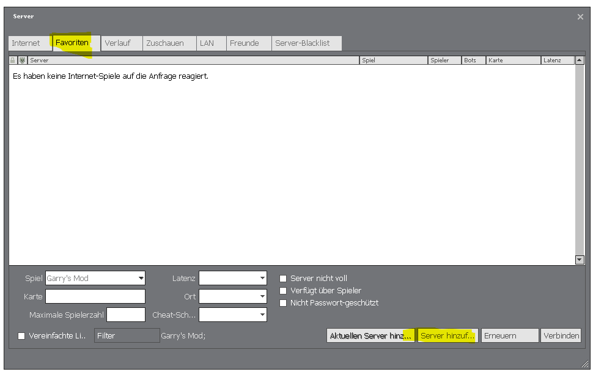
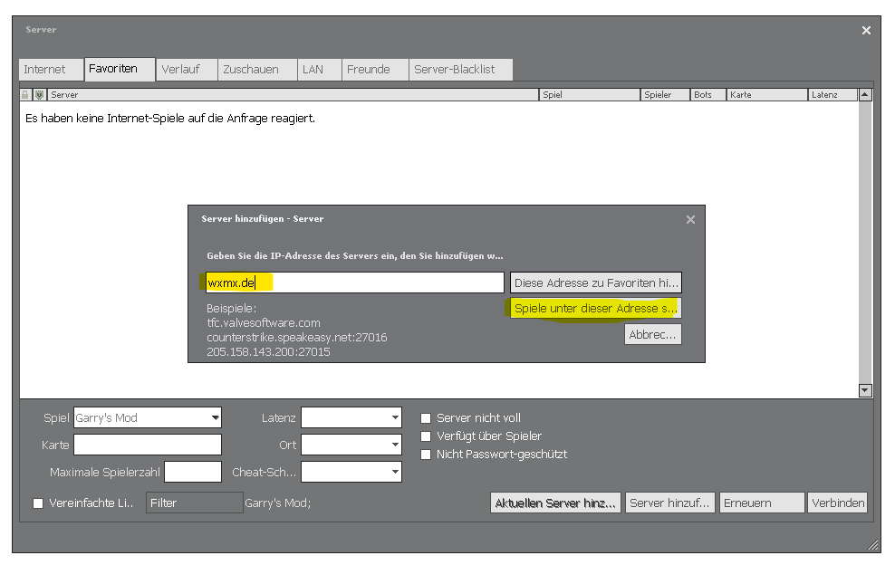
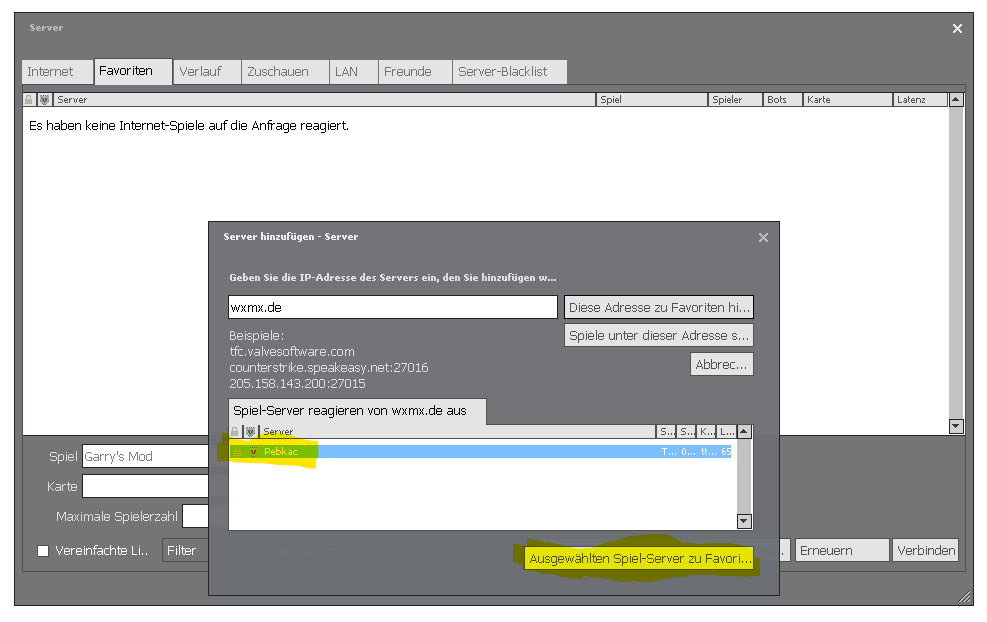

# CMR TTT
## Zum Server verbinden
- Garry's mod starten
- Im Spiel auf `Find Multiplayer Game` clicken
- Auf `Trouble in Terrorist Town` clicken
- `Pebkac` suchen
- Passwort aus der Beschreibung vom Garry's Mod Channel auf dem TS eingeben

### Alternativ verbinden wenn man den Server nicht findet
Garry's mod starten  
Im Spiel auf `Find Multiplayer Game` clicken  
Auf `Legacy Browser` clicken  
Dort auf `Favoriten` und dann auf `Server hinzufügen`:  
  
In dem Feld `wxmx.de` eingeben und auf `Spiele unter dieser Adresse suchen` clicken:  
  
`Pebkac` aus der Liste auswählen und auf `Ausgewählten Spiele-Server zu Favoriten hinzufügen` clicken:  
  
Jetzt kann man aus dem Legacy Browser heraus auf den Server verbinden und sollte ihn auch im normalen Server Browser unter den Favoriten haben.  
